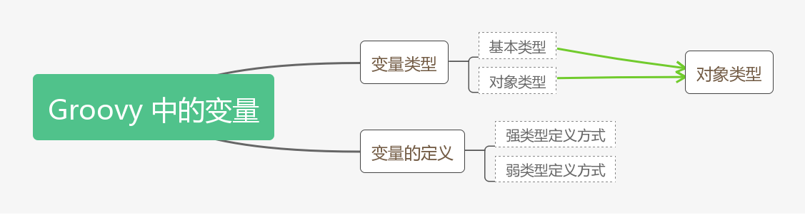
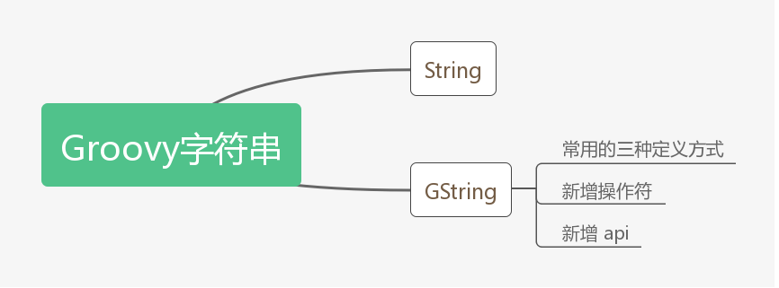
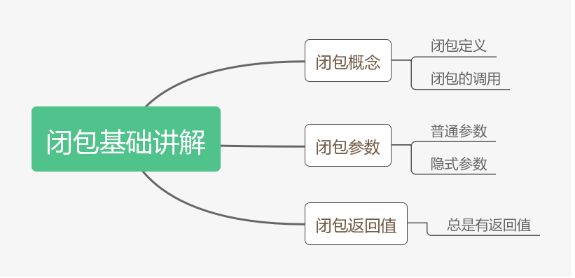

# Groovy 核心语法

## Groovy 基础语法

### 变量



1. **基本类型**

```groovy
package variable

int num = 10
println num.class //==> class java.lang.Integer
```

由此可见基本类型也是对象类型

2. **变量的定义**

```groovy
def x = 0
println x.class	//==> class java.lang.Integer
def y = 1.0
println y.class	//==> class java.math.BigDecimal
def name = "Hello"
println name.class	//==> class java.lang.String
```

- 内部使用推荐使用弱类型 `def`
- 在其他类或其他应用模块使用，定义强类型

### 字符串



```groovy
def str = '单引号'
def longStr = '''三引号有格式'''
def dstr = "双引号可拓展：1 + 2 = ${1 + 2}" //==> 拓展后为 GString 类型
```

```groovy
//字符串填充
println str.center(8,"A")
println str.padLeft(8,"A")
//字符串范围输出
println str[0]
println str[0..1]
//字符串排除
println str.minus(str2)
println str - str2
//字符串首字母大写
println str.capitalize()
//判断是否是数字类型的字符串
println str.isNumber()
```


## Groovy 闭包

### 基础



```groovy
package core
/**
 * 创建闭包
 */
def closer = { println 'Hello groovy!'}
/**
 * 调用闭包，两种方式
 */
closer.call()
//closer()

/**
 * 闭包传递参数，用逗号隔开每个参数
 */
closer = { String name,int age -> println "Hello $name, My age is ${age}"}
closer.call("小明",1)
//closer("小明",1)
closer = {
    println("${it} param")  //如果不指定参数，闭包就会有个 it 默认参数
}
closer("default")

/**
 * 闭包返回值
 */
closer = {
    "Hello closer"  //默认最后一行就是返回值
}
println closer()

```


### 使用


### 进阶

## Groovy 数据结构


## Groovy 面向对象
