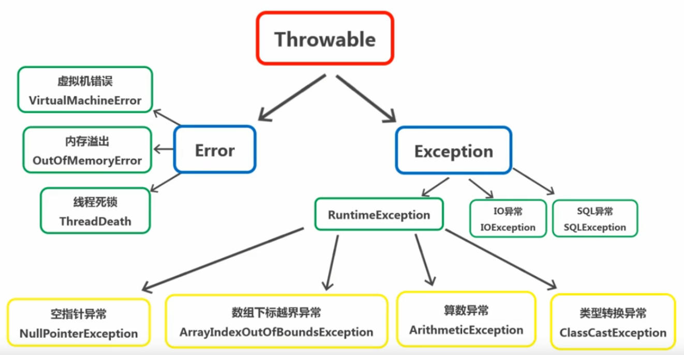

## 什么异常
> 程序有编译期错误和运行期错误，异常就是运行期的错误
## 异常的分类
- Throwable
 1. Error | 不可排查
    > Error 是程序无法处理的错误，表示运行应用程序中较为严重的问题（虚拟机出现问题，eg：虚拟机错误 VirtualMachineError、
    内存溢出错误 OutOfMemoryError、线程锁死错误 ThreadDeath）
 2. Exception | 可排查
    - Unchecked Exception | 非检查异常、编译器不管它，爱处理不处理
    > 编译器不要求强制处理的异常，RuntimeException(eg：空指针异常 NullPointerException、
 数组下标越界异常 ArrayIndexOutOfBoundsException、算数异常 ArithmeticException、类型转换异常ClassCastException...)
    - Checked Exception | 检查异常、编译器要求必须处理
    > eg：IO异常 IOException、SQL异常 SQLException
--- 

## 异常处理
### 五个关键字
try、catch、finally、throw、throws
- 捕获异常：try、catch、finally
- 声明异常：throws（声明类型）
- 抛出异常：throw（抛出对象）

> try、catch、finally 使用 return 需要注意