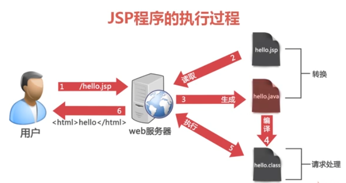

## 动态项目的结构
--src     应用程序源代码和测试程序代码的根目录

　　--main　　

　　　　--java　　应用程序源代码目录

　　　　--resources　　应用程序用到的资源文件（一般都是配置文件）

--web　　web项目根目录　　

　　　　--WEB-INF　　

　　　　    --web.xml　　web项目配置文件

　　　　--index.jsp　　默认欢迎页

--target　　编译后的输出目录，临时创建的

## JSP 程序执行过程


## JSP 基本语法
### JSP 声明语法
语法格式：
```jsp
<%! String str = "hello world"; %>
```
> 注意 ！号
- 定义成员变量，以及成员方法
- 不能直接包含程序语句

### JSP 程序脚本
- 包含变量的声明，表达式和程序逻辑
- 声明的变量转化为 _service 方法中的变量，因而是局部变量
- 语句块可以自由地与页面代码组合使用
```jsp
<% if (i > 10) { %>
<span>i > 10</span>
<%} else { %>
<span>i <= 10</span>
<%} %>
</body>
</html>
```
### JSP 内容输出表达式
语法格式：
```jsp
<%!
    int i = 10;
%>
<%=i%>
```
- 输出的变量名称不需要添加分号
`<%=getInfo()%>`
### 包引入语法
语法格式：
```jsp
<%@ page import="java.util.Date" %>
<%--不同的包引用被逗号隔开，作为一个整体的字符串--%>
<%@ page import="java.util.Date,java.io.*" %>
```
