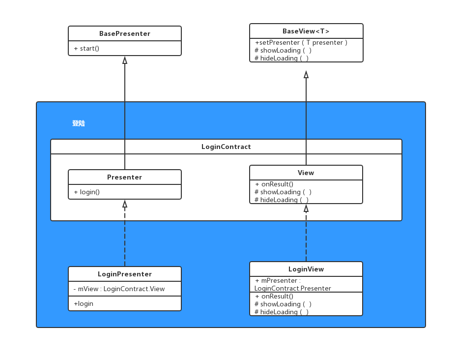

## MVP

> （右击打开链接）: [详解八大UML类图符号的表示法 .pdf](详解八大UML类图符号的表示法 .pdf) 

### Google 官方简单框架



### 改造后


## KOTLIN 配置

```groovy
//build.gradle(Project：xx) 文件里
classpath "org.jetbrains.kotlin:kotlin-gradle-plugin:1.3.21"

//build.gradle(Module:xx) 文件里
apply plugin: 'kotlin-android'
apply plugin: 'kotlin-android-extensions'
```

> ( 右击打开链接)
>
> 1. [搜索并下载 kotlin 插件](png\1553526235(1).png)
>
> 2. [选择 kotlin 工具](png\1553525902(1).png)
> 3. [选择转换android](png\1553526382(1).png)
> 4. [模块和版本选择](png\1553526445(1).png)
> 5. 配置之后，默认按：crtl + shift + alt + k 可将 **xx.java** 转成 **xx.kt** 文件

## 模块化

```groovy
//gradle.properties(Project Properties) 文件里
xxx = true

//build.gradle(Module:xx) 文件里
if(xxx.toBoolean()){
    apply plugin:'com.android.library'
}else{
    apply plugin:'com.android.application'
}
android{
	sourceSets {
    	main {
        	if (xxx.toBoolean()) {
            	manifest.srcFile 'src/main/release/AndroidManifest.xml'
            	java{
                	exclude 'debug/**'
            	}
        	} else {
            	manifest.srcFile 'src/main/debug/AndroidManifest.xml'
        	}
    	}
	}
}
```
> **两套 androidManifest文件，一套为 application 配置，一套为 library 配置** 
>
> ( 右击打开链接) [两套 androidManifest文件](png\1553524486(1).png)

## 视图层

### Android-extensions （kotlin 配置完直接使用）

`apply plugin: 'kotlin-android-extensions'`

-  视图绑定，直接使用 xml 文件中的 id
-  插件级别，无需引入第三方库
-  无需定义变量
-  适用于 Activity、Fragment、Adapter、自定义 View

### ANKO（kotlin 扩展库）

- **Anko Commons（主要）**
  1. Intents 跳转类（[Wiki](https://github.com/Kotlin/anko/wiki/Anko-Commons-%E2%80%93-Intents)）
  2. Dialogs and toasts 提示类（[Wiki](https://github.com/Kotlin/anko/wiki/Anko-Commons-%E2%80%93-Dialogs)）
  3. Logging  日志类（[Wiki](https://github.com/Kotlin/anko/wiki/Anko-Commons-%E2%80%93-Logging)）
  4. Resources and dimensions 尺寸类（[Wiki](https://github.com/Kotlin/anko/wiki/Anko-Commons-%E2%80%93-Misc)）
- *Anko Layouts（次要）*
- *Anko SQLite（次要）*
-  *Anko Coroutines（次要）*

[ANKO Github 地址](https://github.com/Kotlin/anko)

## 业务层

### RxKotlin

-  基于 RxJava 的扩展库，以 kotlin 的风格提供大量的扩展方法
-  响应式编程
-  观察者模式

[RxKotlin Github 地址](<https://github.com/ReactiveX/RxKotlin>)

```groovy
//RxKotlin 2.x 配置，示例项目用的是 2.x
implementation 'io.reactivex.rxjava2:rxkotlin:x.y.z'
//RxKotlin 1.x 配置
implementation 'io.reactivex:rxkotlin:x.y.z'
```

### RxAndroid

-  基于 RxJava 的扩展库
-  兼容 Android 特性，如主线程、UI 事件

[RxAndroid Github 地址](<https://github.com/ReactiveX/RxAndroid>)

```groovy
//配置
implementation 'io.reactivex.rxjava2:rxandroid:2.1.1'
```


### Rx 统一处理

#### Observable<T>

```kotlin
//新建个 kt 文件（不是类文件！！直接为某个类扩展方法）
fun <T> Observable<T>.execute(subscriber: BaseObserver<T>) {
    return this.subscribeOn(Schedulers.io())
            .observeOn(AndroidSchedulers.mainThread())
            .subscribe(subscriber)
}
```

#### BaseObserver

```kotlin
open class BaseObserver<T> constructor(private var mView: BaseView) : Observer<T> {
    private lateinit var mDisposable: Disposable
    override fun onComplete() {
        unSubscribe()
    }

    override fun onSubscribe(d: Disposable) {
        mDisposable = d
    }

    override fun onNext(result: T) {
    }

    override fun onError(e: Throwable) {
        try {
            when (e) {
                is ConnectException -> mView.onError("连接异常，请检查网络")
                is SocketTimeoutException -> mView.onError("连接超时，请检查网络")
                is NullPointerException -> mView.onError("无数据，请核实")
            }
        } catch (e: IllegalStateException) {
            mView.onError("${e.message}")
        }
        unSubscribe()
    }

    private fun unSubscribe() {
        if (!mDisposable.isDisposed) {
            mDisposable.dispose()
        }
        mView.hideloading()
    }
}
```

## 网络层

### Retrofit2

### 配置

```groovy
api "com.squareup.okhttp3:okhttp:3.10.0"
api "com.squareup.okhttp3:logging-interceptor:3.10.0"
api "com.squareup.retrofit2:retrofit:2.4.0"
api "com.squareup.retrofit2:converter-gson:2.4.0"
api "com.squareup.retrofit2:adapter-rxjava2:2.4.0"
```

### RetrofitFactory

```kotlin
class RetrofitFactory private constructor() {
    companion object {
        val instant: RetrofitFactory by lazy { RetrofitFactory() }
    }

    private val retrofit: Retrofit

    init {
        retrofit = Retrofit.Builder()
                .baseUrl("http://apis.juhe.cn/")
                .addConverterFactory(GsonConverterFactory.create()) //Json数据转换支持
                .addCallAdapterFactory(RxJava2CallAdapterFactory.create()) //Rx支持
                .client(initClient())
                .build()
    }

    private fun initClient(): OkHttpClient {
        return OkHttpClient.Builder()
                .addInterceptor(initInterceptor())	//初始化拦截器
                .connectTimeout(10, TimeUnit.SECONDS)
                .readTimeout(10, TimeUnit.SECONDS)
                .build()
    }

    private fun initInterceptor(): Interceptor {
        val interceptor = HttpLoggingInterceptor()	//日志拦截器
        interceptor.level = HttpLoggingInterceptor.Level.BODY	//拦截 leve
        return interceptor
    }
    
    fun <T> create(service: Class<T>): T {
        return retrofit.create(service)
    }
}
```

## 其他

### ARouter

> 阿里推出的模块间的路由、通信、解耦框架，可直接浏览官方中文 wiki
>
> [ARouter Github 地址](<https://github.com/ReactiveX/RxAndroid>)